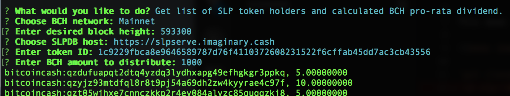

## slp-list

Lists SLP token holders and balances for any blockchain height.

### BCH Dividend Demo

This demo prints receiver list and calculated pro-rata BCH dividend payout amount. Copy/Paste the resulting list into Electron Cash.




#### Get Started
```
git clone https://github.com/simpleledger/slp-list.git
cd slp-list
npm install
npm start
```

## Install as library

`npm install slp-list`

## Install for browser

```<script src='https://unpkg.com/slp-list'></script>```

## Change Log

### demo.ts updates
- Removed BigNumber.js dependency from demo.ts in favor of Big.js 
- NOTE: All number rounding in demo uses default of ROUND_HALF_UP

### 0.0.6
- Updated gRPC deps and utilized the new getMedianTime() method

### 0.0.5
- Switched to big.js from bignumber.js in deps (demo.ts still uses BigNumber.js)
- Added MTP block selection option in demo.ts
- Other minor updates
